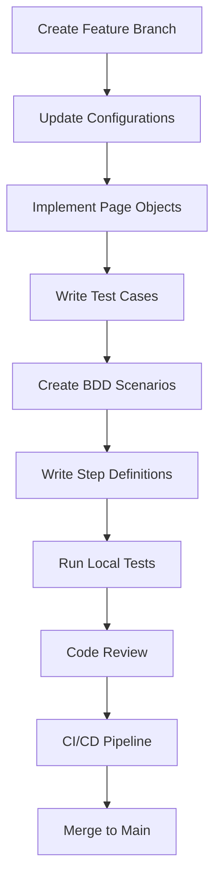

# Development Workflow and Best Practices

**Professional Development Guidelines for the Playwright E2E Framework**

## 🎯 Overview

This guide establishes development standards, workflows, and best practices for maintaining and extending the Playwright E2E Testing Framework, ensuring consistency, quality, and scalability across the entire testing suite.

## 🏗️ Development Principles

### **1. Framework Design Principles**

#### **Separation of Concerns**
- **Application Logic**: Each app has dedicated directories and implementations
- **Environment Logic**: Environment-specific configurations are isolated  
- **Core Framework**: Base utilities and shared components are reusable
- **Test Logic**: Clear separation between test files and supporting code

#### **Maintainability**
- **DRY (Don't Repeat Yourself)**: Shared utilities and components
- **Single Responsibility**: Each class/function has one clear purpose
- **Consistent Naming**: Clear, descriptive names across all files
- **Documentation**: Comprehensive inline and external documentation

#### **Scalability**
- **Modular Architecture**: Easy to add new applications and test types
- **Configuration-Driven**: Behavior controlled through configuration
- **Parallel Execution**: Optimized for concurrent test execution
- **Resource Management**: Efficient browser and memory usage

---

## 🚀 Development Workflow

### **1. Setting Up Development Environment**

#### **Initial Setup**

```bash
# Clone the repository
git clone <repository-url>
cd playwright-e2e-tests

# Install dependencies
npm install

# Install Playwright browsers
npx playwright install

# Set up environment files
cp .env.example .env.local
cp .env.example .env.test

# Validate setup
npm run framework:validate
```

#### **IDE Configuration**

**VS Code Extensions:**
- Playwright Test for VS Code
- TypeScript and JavaScript Language Features
- Gherkin syntax highlighting for .feature files
- ESLint
- Prettier

**VS Code Settings** (`.vscode/settings.json`):
```json
{
  "typescript.preferences.importModuleSpecifier": "relative",
  "editor.formatOnSave": true,
  "playwright.showTrace": true,
  "files.associations": {
    "*.feature": "gherkin"
  }
}
```

### **2. Development Workflow Steps**

#### **Feature Development Flow**



#### **Step-by-Step Process**

**Step 1: Create Feature Branch**
```bash
# Create and switch to feature branch
git checkout -b feature/add-user-profile-tests

# Ensure you're starting from latest main
git pull origin main
```

**Step 2: Update Configurations**
```bash
# Add new application config if needed
touch config/applications/new-app.config.ts

# Update environment configs as needed
vim config/environments/dev.config.ts
```

**Step 3: Implement Page Objects**
```typescript
// src/applications/webapp/pages/UserProfilePage.ts
export class UserProfilePage {
  constructor(private page: Page) {}

  async navigateToProfile(): Promise<void> {
    await this.page.click('[data-testid="profile-link"]');
    await this.page.waitForURL('**/profile');
  }

  async updateDisplayName(name: string): Promise<void> {
    await this.page.fill('[data-testid="display-name"]', name);
    await this.page.click('[data-testid="save-profile"]');
  }
}
```

**Step 4: Write Test Cases**
```typescript
// tests/webapp/ui/user-profile.spec.ts
import { test, expect } from '@playwright/test';
import { UserProfilePage } from '../../../src/applications/webapp/pages/UserProfilePage';

test.describe('User Profile Management', () => {
  test('should update display name successfully', async ({ page }) => {
    const profilePage = new UserProfilePage(page);
    
    await profilePage.navigateToProfile();
    await profilePage.updateDisplayName('John Doe');
    
    await expect(page.locator('[data-testid="display-name"]')).toHaveValue('John Doe');
  });
});
```

**Step 5: Create BDD Scenarios**
```gherkin
# features/webapp/ui/user-profile.feature
@webapp @profile @regression
Feature: User Profile Management
  As a webapp user
  I want to manage my profile information
  So that I can personalize my account

  @smoke
  Scenario: Update display name
    Given I am logged in to the webapp
    And I am on my profile page
    When I change my display name to "John Doe"
    And I save my profile changes
    Then my display name should be updated to "John Doe"
```

**Step 6: Write Step Definitions**
```typescript
// features/steps/webapp/user-profile-steps.ts
import { Given, When, Then } from 'playwright-bdd';
import { expect } from '@playwright/test';
import { test } from '../fixtures';

Given('I am on my profile page', async ({ testWorld, navigationHelper }) => {
  await navigationHelper.navigateToUserProfile();
  await testWorld.waitForPageLoad();
});

When('I change my display name to {string}', async ({ testWorld }, name: string) => {
  await testWorld.page.fill('[data-testid="display-name"]', name);
});

Then('my display name should be updated to {string}', async ({ testWorld }, name: string) => {
  await expect(testWorld.page.locator('[data-testid="display-name"]')).toHaveValue(name);
});
```

**Step 7: Run Local Tests**
```bash
# Run specific test file
npx playwright test tests/webapp/ui/user-profile.spec.ts --config=config/playwright.config.ts

# Generate and run BDD tests
npm run bdd:generate
npm run bdd:webapp

# Run all relevant tests
npm run test:webapp:ui
```

---

## 📋 Code Standards and Conventions

### **1. TypeScript Standards**

#### **File Naming Conventions**
```
PascalCase for classes:     UserProfilePage.ts
camelCase for functions:    navigationHelper.ts
kebab-case for configs:     webapp.config.ts
kebab-case for features:    user-profile.feature
kebab-case for specs:       user-profile.spec.ts
```

#### **Code Structure Standards**

**Class Structure:**
```typescript
export class UserProfilePage {
  // Properties first
  private readonly timeout = 30000;
  
  // Constructor
  constructor(private page: Page, private config: WebappConfig) {}
  
  // Public methods
  public async navigateToProfile(): Promise<void> {
    // Implementation
  }
  
  // Private helper methods
  private async waitForProfileLoad(): Promise<void> {
    // Implementation
  }
}
```

**Function Standards:**
```typescript
// Good: Clear naming and return types
async function createUserWithRole(role: string): Promise<User> {
  // Implementation
}

// Good: Descriptive parameter names
async function waitForElementWithTimeout(
  selector: string, 
  timeout: number = 30000
): Promise<void> {
  // Implementation
}

// Poor: Unclear naming
async function doStuff(x: any): Promise<any> {
  // Implementation
}
```

#### **Import Organization**

```typescript
// 1. Node.js/external imports
import { test, expect } from '@playwright/test';
import { Page } from '@playwright/test';

// 2. Framework imports
import { TestWorld } from '../../core/base/TestWorld';
import { NavigationHelper } from '../../shared/helpers/NavigationHelper';

// 3. Application imports
import { WebappBasePage } from './WebappBasePage';
import { webappConfig } from '../../../config/applications/webapp.config';

// 4. Type imports (if needed)
import type { WebappConfig } from '../../../config/applications/webapp.config';
```

### **2. Test Standards**

#### **Test Organization**

```typescript
test.describe('Feature Name', () => {
  // Setup hooks
  test.beforeEach(async ({ page }) => {
    // Common setup
  });
  
  // Group related tests
  test.describe('Positive Scenarios', () => {
    test('should handle valid input successfully', async ({ page }) => {
      // Test implementation
    });
  });
  
  test.describe('Error Scenarios', () => {
    test('should handle invalid input gracefully', async ({ page }) => {
      // Test implementation
    });
  });
  
  // Cleanup hooks
  test.afterEach(async ({ page }) => {
    // Cleanup if needed
  });
});
```

#### **Assertion Best Practices**

```typescript
// Good: Specific, descriptive assertions
await expect(page.locator('[data-testid="user-name"]')).toHaveText('John Doe');
await expect(page).toHaveURL(/\/profile$/);
await expect(page.locator('.success-message')).toContainText('Profile updated');

// Good: Wait for conditions
await page.waitForSelector('[data-testid="profile-form"]');
await expect(page.locator('[data-testid="save-button"]')).toBeEnabled();

// Poor: Generic assertions
expect(true).toBe(true);
await expect(page.locator('div')).toBeVisible();
```

#### **Test Data Management**

```typescript
// Good: Use test data builders
const user = new UserBuilder()
  .withName('John Doe')
  .withEmail('john@example.com')
  .withRole('admin')
  .build();

// Good: Environment-aware test data
const testUser = testWorld.getTestUser('admin');
const testDocument = testWorld.getTestDocument('pdf');

// Poor: Hardcoded test data
const user = {
  name: 'John Doe',
  email: 'john@example.com',
  role: 'admin'
};
```

### **3. BDD Standards**

#### **Feature File Structure**

```gherkin
@application @feature-area @test-level
Feature: Clear, business-focused title
  As a [user type]
  I want to [action]
  So that [business value]

  Background:
    Given common preconditions

  @priority @additional-tags
  Scenario: Specific, testable behavior
    Given initial state
    When action is performed
    Then expected result occurs
    And additional verification

  @priority @additional-tags  
  Scenario Outline: Data-driven scenario
    Given initial state with "<parameter>"
    When action is performed
    Then expected "<result>" occurs

    Examples:
      | parameter | result |
      | value1    | result1|
      | value2    | result2|
```

#### **Step Definition Standards**

```typescript
// Good: Reusable, parameterized steps
Given('I am logged in as a {string}', async ({ testWorld }, role: string) => {
  await testWorld.authenticationHelper.loginWithRole(role);
});

// Good: Clear action steps
When('I upload a document named {string}', async ({ testWorld }, fileName: string) => {
  const filePath = testWorld.getTestFilePath(fileName);
  await testWorld.page.setInputFiles('[data-testid="file-upload"]', filePath);
});

// Good: Verification steps
Then('I should see the success message {string}', async ({ testWorld }, message: string) => {
  await expect(testWorld.page.locator('.success-message')).toContainText(message);
});

// Poor: Too specific, not reusable
When('I click the second button in the top navigation bar', async ({ page }) => {
  await page.click('nav button:nth-child(2)');
});
```

---

## 🔧 Quality Assurance

### **1. Code Review Process**

#### **Pre-Review Checklist**

**Developer Checklist:**
- [ ] All tests pass locally
- [ ] Code follows naming conventions
- [ ] Documentation is updated
- [ ] No hardcoded values or credentials
- [ ] Error handling is appropriate
- [ ] Code is DRY and follows single responsibility principle

**Testing Checklist:**
- [ ] New tests cover edge cases
- [ ] Existing tests still pass
- [ ] BDD scenarios are business-readable
- [ ] Test data is properly managed
- [ ] Tests are properly tagged and categorized

#### **Code Review Guidelines**

**Review Focus Areas:**
1. **Functionality**: Does the code work correctly?
2. **Maintainability**: Is the code easy to understand and modify?
3. **Performance**: Are there any performance concerns?
4. **Security**: Are there any security vulnerabilities?
5. **Standards**: Does it follow our coding standards?

**Review Comments Examples:**

```typescript
// Good feedback
// Consider extracting this magic number to a constant
const MAX_RETRY_ATTEMPTS = 3;

// Suggestion: Use a more descriptive variable name
const userProfileData = getUserProfileData(); // instead of 'data'

// Question: Should we add error handling for this API call?
```

### **2. Testing Standards**

#### **Test Coverage Requirements**

- **Unit Tests**: Not applicable (E2E focused framework)
- **Integration Tests**: Critical user workflows must be covered
- **UI Tests**: All major user interfaces must have smoke tests
- **API Tests**: All API endpoints must have basic validation
- **Cross-Application**: Major business workflows must be tested

#### **Test Categorization**

```typescript
// Use appropriate tags and categories
test.describe('Login Functionality', () => {
  test('should login with valid credentials @smoke @critical', async ({ page }) => {
    // Critical path test
  });
  
  test('should handle invalid credentials gracefully @regression', async ({ page }) => {
    // Error handling test
  });
  
  test('should support multi-factor authentication @integration @security', async ({ page }) => {
    // Complex integration test
  });
});
```

### **3. Performance Standards**

#### **Test Execution Performance**

- **Smoke Tests**: Should complete within 5 minutes
- **Regression Tests**: Should complete within 30 minutes
- **Full Suite**: Should complete within 60 minutes
- **Individual Tests**: Should complete within 30 seconds (except @slow tests)

#### **Resource Management**

```typescript
// Good: Proper cleanup
test.afterEach(async ({ page }) => {
  await page.close();
  // Clean up test data if needed
});

// Good: Efficient selectors
await page.locator('[data-testid="user-profile"]').click();

// Poor: Inefficient selectors
await page.locator('div > div > div:nth-child(3) > button').click();
```

---

## 🔄 Continuous Integration

### **1. CI/CD Pipeline Standards**

#### **Pre-commit Hooks**

```bash
# .husky/pre-commit
#!/bin/sh
npm run lint
npm run type-check
npm run test:smoke
```

#### **Pipeline Stages**

1. **Install & Setup**: Dependencies and environment setup
2. **Lint & Type Check**: Code quality validation
3. **Unit Tests**: Fast feedback on code changes
4. **Smoke Tests**: Critical path validation
5. **Regression Tests**: Comprehensive feature validation
6. **Report Generation**: Test results and artifacts

#### **Branch Protection Rules**

- **Main Branch**: Requires PR review + passing CI
- **Feature Branches**: Requires passing smoke tests
- **Release Branches**: Requires full test suite execution

### **2. Deployment Workflow**

#### **Environment Promotion**

```
Development → Testing → Staging → Production
     ↓            ↓        ↓         ↓
Smoke Tests → Full Tests → UAT → Monitoring
```

#### **Release Process**

```bash
# 1. Create release branch
git checkout -b release/v1.2.0

# 2. Update version and changelog
npm version minor
git add CHANGELOG.md

# 3. Run full test suite
npm run test:all

# 4. Create release PR
gh pr create --title "Release v1.2.0"

# 5. After approval, merge and tag
git tag v1.2.0
git push origin v1.2.0
```

---

## 📚 Documentation Standards

### **1. Code Documentation**

#### **JSDoc Comments**

```typescript
/**
 * Navigates to the user profile page and waits for it to load
 * @param userId - Optional user ID, defaults to current user
 * @returns Promise that resolves when navigation is complete
 * @throws Error if navigation fails or times out
 * @example
 * await navigationHelper.navigateToUserProfile('user123');
 */
async navigateToUserProfile(userId?: string): Promise<void> {
  // Implementation
}
```

#### **README Files**

Each major directory should have a README.md explaining:
- Purpose and scope
- Key files and their roles
- Usage examples
- Maintenance instructions

### **2. Test Documentation**

#### **Feature Documentation**

```gherkin
# Document business context in features
Feature: User Authentication
  # Background context for stakeholders
  """
  User authentication is critical for security and personalization.
  This feature ensures users can securely access their accounts
  while providing appropriate error messages for failed attempts.
  """
  
  As a webapp user
  I want to authenticate securely
  So that I can access my personal data safely
```

#### **Test Case Documentation**

```typescript
test.describe('User Authentication', () => {
  /**
   * Test validates the happy path login flow
   * Covers: Authentication, session management, redirection
   * Business Impact: Critical user onboarding flow
   */
  test('should authenticate valid user successfully', async ({ page }) => {
    // Test implementation with clear comments
  });
});
```

---

## 🛡️ Security and Compliance

### **1. Secure Development Practices**

#### **Credential Management**
```typescript
// Good: Use environment variables
const apiKey = process.env.API_KEY;

// Good: Use test-specific credentials
const testUser = testWorld.getTestCredentials('standard-user');

// Poor: Hardcoded credentials
const apiKey = 'sk-1234567890abcdef';
```

#### **Data Privacy**
```typescript
// Good: Anonymized test data
const testUser = {
  name: faker.person.fullName(),
  email: faker.internet.email(),
  id: faker.string.uuid()
};

// Poor: Real user data
const testUser = {
  name: 'John Smith',
  email: 'john.smith@realcompany.com',
  ssn: '123-45-6789'
};
```

### **2. Compliance Requirements**

#### **Audit Trails**
- All test executions must be logged
- Test data usage must be trackable
- Failed tests must generate detailed reports

#### **Data Retention**
- Test reports: 90 days
- Screenshots/videos: 30 days
- Test data: Cleaned after each run

---

## 🔧 Maintenance and Troubleshooting

### **1. Regular Maintenance Tasks**

#### **Weekly Tasks**
- Review and clean test data
- Update dependencies (security patches)
- Monitor test execution performance
- Review failed test trends

#### **Monthly Tasks**
- Update browser versions
- Review and update documentation
- Performance optimization review
- Security vulnerability assessment

#### **Quarterly Tasks**
- Framework architecture review
- Tool and library updates
- Performance benchmarking
- Documentation comprehensive review

### **2. Common Issues and Solutions**

#### **Test Flakiness**
```typescript
// Problem: Timing issues
await page.click('button');
await expect(page.locator('.result')).toBeVisible(); // Might fail

// Solution: Wait for conditions
await page.click('button');
await page.waitForSelector('.loading', { state: 'hidden' });
await expect(page.locator('.result')).toBeVisible();
```

#### **Configuration Issues**
```bash
# Problem: Environment not loading
NODE_ENV=staging npm run test # Might use wrong config

# Solution: Explicit validation
npm run framework:validate-env
NODE_ENV=staging npm run framework:validate
```

This comprehensive development workflow guide ensures consistent, high-quality development practices across the entire Playwright E2E Testing Framework, promoting maintainability, scalability, and reliability.